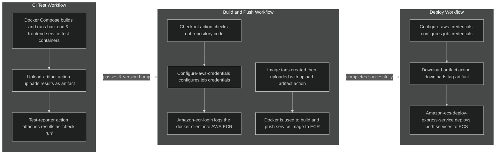
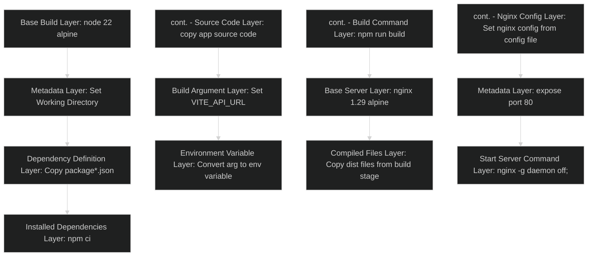

# Explaining the Relations & Dependencies of Services & Technologies Managed by CI/CD Platform

The following is an explanation of all services and technologies that are used, configured or managed by the CI/CD automation workflows of this application, including the CI/CD automation platform itself.

## GitHub Actions

GitHub Actions acts as the orchestrator for CI/CD automation for this application, managing the entire lifecycle from the initial code change, to the final deployment. In doing so, this application reduces human error, enforces consistent and safe code integration, and increases the speed and efficiency of creating new iterations of the application.

This process is achieved through the implementation of three workflow files, which are [explained in greater detail here](WORKFLOWS_EXPLAINED.md), and expanded on briefly below:

1. `ci-test.yaml`: This workflow automates testing of the backend and frontend services before they can be merged to the main branch, attaching persistent reports to the pull request as check runs.
2. `build-and-push.yaml`: This workflow builds a container image of the frontend and backend service, pushing it to the AWS Elastic Container Registry (ECR). This workflow is triggered manually or through a Git version update, with the container images being semantically tagged depending on their current version.
3. `deploy.yaml`: This workflow automates deployment of the application to AWS Elastic Container Service (ECS), using the previously built container images.

An overview of the services and technologies utilized within the workflows:

### Why GitHub Actions?

There are multiple automation platforms available to developers, but the one used by this application is GitHub Actions, which makes use of yaml workflow files to execute instructions in 'runners' (a virtual machine instance). It also has an impressive suite of predefined actions available in the GitHub Marketplace, allowing developers to abstract many automation jobs. [According to a 2025 Jetbrains Survey](https://blog.jetbrains.com/teamcity/2025/10/the-state-of-cicd/), GitHub Actions leads in popularity as the CI/CD tool of choice, with the next three being GitLab CI, Jenkins and Azure DevOps Server respectively. The chart below shows a comparison of the options, with each comparison to be expanded on:

|                             | **GitHub Actions**  |    **GitLabs CI**     |     **Jenkins**     |    **Azure DevOps**     |
| :-------------------------: | :-----------------: | :-------------------: | :-----------------: | :---------------------: |
|  **Control Plane Hosting**  |        SaaS         |  SaaS or Self Hosted  |     Self Hosted     |   SaaS or Self Hosted   |
|     **Runner Hosting**      | SaaS or Self Hosted |  SaaS or Self Hosted  |     Self Hosted     |   SaaS or Self Hosted   |
|     **Learning Curve**      |         Low         |        Medium         |      Very High      |          High           |
| **GitHub Repo Integration** |      Simplest       |        Complex        |    Most Complex     |         Simple          |
|  **Cost With Public Repo**  |        Free         | Free, Limited Runners | Infrastructure Cost |     Licencing Cost      |
|  **Ecosystem Integration**  | Actions Marketplace |    CI/CD Catalogue    |   Jenkins Plugins   | Azure Devops Extensions |

**Control Plane Hosting:** This refers to the hosting of the 'control plane' of the CI/CD tool, being the hardware and software orchestrating the execution of the workflows. This is separate to the 'runner' virtual machine instances that execute specific workflow tasks, with the control plane handling the management of these runners. For the scope of our application, a CI/CD tool offering this as cloud hosted Software as a Service (SaaS) significantly reduces initial setup and ongoing maintenance complexity. Of the 4, only Jenkins does not offer the control plane as SaaS, although some third party providers do offer this as a service.
_**Result:**_ GitHub Actions: 1 | GitLabs CI: 1 | Jenkins: 0 | Azure Devops: 1

**Runner Hosting:** As mentioned above, a runner is a virtual machine instance that executes workflow tasks within. For the same reason as the control plane hosting, having cloud hosted SaaS runners for our application is desired. Again, Jenkins is the only one which does not offer this.
_**Result:**_ GitHub Actions: 2 | GitLabs CI: 2 | Jenkins: 0 | Azure Devops: 2

**Learning Curve:** This is a comparison of both the base learning curve of these tools, adjusted to consider my familiarity with GitHub as a platform. GitHub Actions is widely considered the easiest learning curve, especially for someone already familiar with the platform. It features an extremely comprehensive suite of documentation, intuitive UI, and extensive community support. On the opposite end of the scale, Jenkins has a significantly steep learning curve, requiring a new user to manage both the hardware and software themselves. Jenkins offers extreme customization, at the expense of ease of use. In second place, GitLabs CI is considered a close second to GitHub Action, but its use of single workflow files for an entire workflow and a less clean workflow syntax keeps it a step behind in learning curve
_**Result:**_ GitHub Actions: 3 | GitLabs CI: 2 | Jenkins: 0 | Azure Devops: 2

**GitHub Repository Integration** This is a slightly unfair but a relevant comparison, as this application already existed on a GitHub Repository. As expected GitHub Actions easily wins here, requiring a simple commit of a workflow to `.github/workflows/` in the repository root. Authentication is also extremely easy to manage with a GitHub Token. GitLabs CI and Azure Devops both require mirroring of the existing repository, and Jenkins requires the complex manual configuration of webhooks.
_**Result:**_ GitHub Actions: 4 | GitLabs CI: 2 | Jenkins: 0 | Azure Devops: 2

**Cost with Public Repository:** Since there are different cost options for public vs private repo's with this application being a public repository, only the cost with public repo's will be compared. Both GitHub Actions and GitLabs CI offer free usage of their control plane service, and free usage of their cloud hosted runners. However, GitLabs CI caps this usage at 400 compute minutes and 10GiB of storage per month. Neither Jenkins nor Azure Devops are able to be used for free, with Azure Devops requiring licencing fees, and Jenkins incurring infrastructure costs for self hosting.
_**Result:**_ GitHub Actions: 5 | GitLabs CI: 2 | Jenkins: 0 | Azure Devops: 2

**Ecosystem Integration:** This refers to the different tools, plugins, templates etc. available to integrate within workflows, offered by the CI/CD tools. Here, GitHub Actions stands ahead with its rapidly growing Actions Marketplace. This ecosystem is open source and hosts over 20,000 actions already, including official actions from verified third party providers like AWS and Google. GitLabs CI's CI/CD catalogue differs by offering reusable components and script templates rather than third party scripts. Azure Devops Extensions Marketplace is more focused on integration across Microsoft services, with a smaller range. Jenkins plugins offer significant customization, but are more complex to manage and fall well short of the amount of actions available on the Actions Marketplace
_**Result:**_ GitHub Actions: 6 | GitLabs CI: 2 | Jenkins: 0 | Azure Devops: 2

**Overall Result:** GitHub Actions stands as the clear leader, winning or tying for every category for my specific use case.

---

## Docker/Docker Compose

Within the CI/CD workflows used by this application, Docker (through `Dockerfile` files) is used to containerize the application services, and Docker Compose (through `docker-compose.yaml` files) is used to orchestrate the management of these containers. More specifically it allows the running of the containerized version of this application as a single cohesive whole.

Using Docker and Docker Compose within this application allows us to package applications into a 'single lightweight executables' that define their own consistent runtime, allowing its hosted application or service to run consistently across whatever environment it is run within.

The `ci-tests.yaml` workflow uses `docker-compose.test.yaml` to orchestrate the building and running of the frontend and backend services, referencing `frontend/Dockerfile` and `backend/Dockerfile` as build instructions for each service.

Within the `build-and-push.yaml` workflow, the `backend/Dockerfile` and `frontend/Dockerfile.prod` files are used to build a container image for each service, to be uploaded to ECR and used within ECS as a container blueprint.Below is a flowchart representing the instructions within the frontend `Dockerfile.prod` file:

### Why Docker?

Docker is currently the most popular containerization platform, and was used by this application as the only containerization platform I was familiar with. Additionally it was chosen as a way to display competency in the most utilized platform. Podman is also a popular choice with its own respective strengths, which are worth comparing still:

|                                |    **Docker**     |    **Podman**     |
| :----------------------------: | :---------------: | :---------------: |
|        **Daemon Based**        |        Yes        |        No         |
|        **Image Format**        | Docker Image, OCI | Docker Image, OCI |
|        **Desktop GUI**         |  Docker Desktop   |  Podman Desktop   |
| **GitHub Actions Integration** |       Great       |       Good        |

**Daemon Based:** The largest difference between the two platforms is Dockers use of a Daemon based architecture, and Podmans Daemonless alternative. The Daemon is responsible for container lifecycle management, starting, stopping and managing running containers, pushing and pulling images from registries, and utilizing host resources. It has the advantage of abstracting complex features like container restarts, and a huge host of community support/documentation. The downside is that it requires root permissions which increase security risks, and that it is a single point of failure. In comparison, Podman directly manages container lifecycle with User level permissions only, cutting out the Daemon middleman. This improves security and spreads points of failures, but can increase complexity for some container management tasks.

**Image Format:** Both platforms offer the ability to utilize both Docker Image and Open Container Initiative (OCI) image formats

**Desktop GUI** Both platforms offer a Graphical User Interface (GUI) desktop application alternative to CLI commands with their own pro's and con's. Docker desktop is more mature, and subsequently more feature rich with greater integration support. However Podman Desktop does not require running of a background Daemon, reducing the application overhead and improving container launch times.

**GitHub Actions Integration:** As the more mature and popular platform, Docker has an advantage in this category with official verified Docker actions, easy layer caching, and extensive documentation. Support for Podman is growing fast, but it still lacks official verified actions and lags behind in documentation and support.

### Why Docker Compose?

Since Docker was chosen as the containerization platform, Docker Compose was a natural choice for container orchestration. It's the most popular integration tool, most seamlessly integrates with Docker, it was a tool I was already familiar with, and is ideal for the basic level orchestration used within this applications CI/CD pipeline. Below I will compare it to the next two most popular orchestration tools, being Podman Compose and Kubernetes:

|                         | **Docker Compose** | **Podman Compose** | **Kubernetes** |
| :---------------------: | :----------------: | :----------------: | -------------- |
| **Orchestration Level** |    Single Host     |    Single Host     | Cluster        |
|    **Configuration**    |    Single File     |    Single File     | Multi-File     |

**Orchestration Level:** Docker Compose and Podman Compose differ wildly in scope compared to Kubernetes for container orchestration. Whereas the first two are designed primarily to orchestrate multi-container applications within a single machine, Kubernetes specializes in orchestration across clusters of multiple machines, potentially thousands. The workflows for this application only require single host container orchestration, making Kubernetes unsuitable.

**Configuration:** Both Docker Compose and Podman Compose are able to define orchestration instructions in a single yaml file. In comparison, Kubernetes requires separate yaml files for each service, networking, storage, configuration, metadata etc. This significantly increases the complexity overhead for a simple application like this one.
