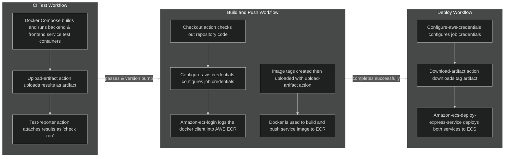
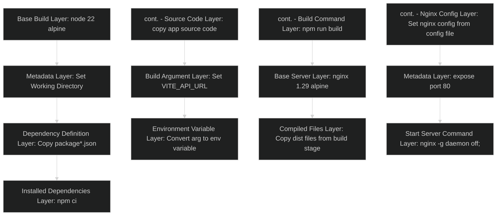
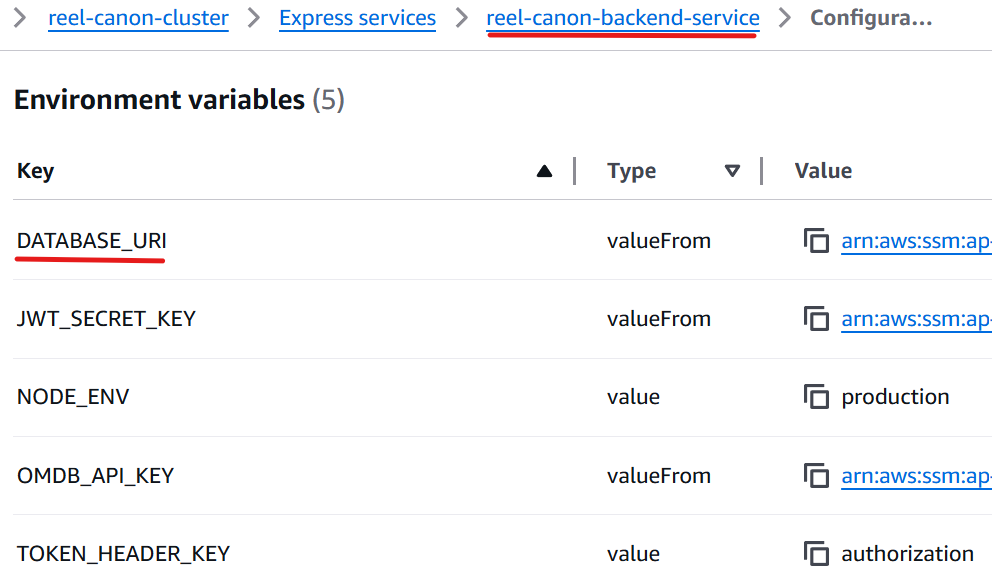
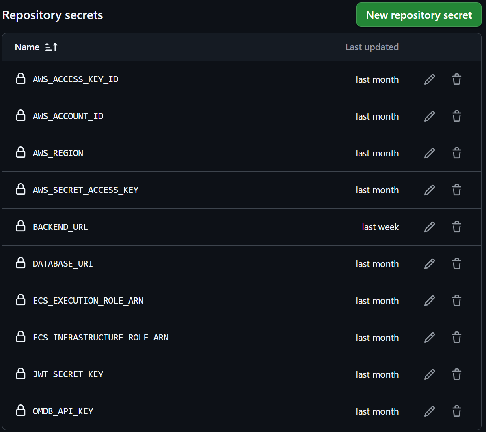

# Explaining the Relations & Dependencies of Services & Technologies Managed by CI/CD Platform

The following is an explanation of all services and technologies that are used, configured or managed by the CI/CD automation workflows of this application, including the CI/CD automation platform itself.

## GitHub Actions

GitHub Actions acts as the orchestrator for CI/CD automation for this application, managing the entire lifecycle from the initial code change, to the final deployment. In doing so, this application reduces human error, enforces consistent and safe code integration, and increases the speed and efficiency of creating new iterations of the application.

This process is achieved through the implementation of three workflow files, which are [explained in greater detail here](WORKFLOWS_EXPLAINED.md), and expanded on briefly below:

1. `ci-test.yaml`: This workflow automates testing of the backend and frontend services before they can be merged to the main branch, attaching persistent reports to the pull request as check runs.
2. `build-and-push.yaml`: This workflow builds a container image of the frontend and backend service, pushing it to the AWS Elastic Container Registry (ECR). This workflow is triggered manually or through a Git version update, with the container images being semantically tagged depending on their current version.
3. `deploy.yaml`: This workflow automates deployment of the application to AWS Elastic Container Service (ECS), using the previously built container images.

An overview of the services and technologies utilized within the workflows:

### Why GitHub Actions?

There are multiple automation platforms available to developers, but the one used by this application is GitHub Actions. This CI/CD tool makes use of yaml workflow files to execute instructions in 'runners' (a virtual machine instance). It also has an impressive suite of predefined actions available in the GitHub Marketplace, allowing developers to abstract many automation jobs.

[According to a 2025 Jetbrains Survey](https://blog.jetbrains.com/teamcity/2025/10/the-state-of-cicd/), GitHub Actions leads in popularity as the CI/CD tool of choice, with the next three being GitLab CI, Jenkins and Azure DevOps Server respectively. The chart below shows a comparison of the options, with each comparison to be expanded on:

|                             | **GitHub Actions**  |    **GitLabs CI**     |     **Jenkins**     |    **Azure DevOps**     |
| :-------------------------: | :-----------------: | :-------------------: | :-----------------: | :---------------------: |
|  **Control Plane Hosting**  |        SaaS         |  SaaS or Self Hosted  |     Self Hosted     |   SaaS or Self Hosted   |
|     **Runner Hosting**      | SaaS or Self Hosted |  SaaS or Self Hosted  |     Self Hosted     |   SaaS or Self Hosted   |
|     **Learning Curve**      |         Low         |        Medium         |      Very High      |          High           |
| **GitHub Repo Integration** |      Simplest       |        Complex        |    Most Complex     |         Simple          |
|  **Cost With Public Repo**  |        Free         | Free, Limited Runners | Infrastructure Cost |     Licencing Cost      |
|  **Ecosystem Integration**  | Actions Marketplace |    CI/CD Catalogue    |   Jenkins Plugins   | Azure Devops Extensions |

1. **Control Plane Hosting:**
   This refers to the hosting of the 'control plane' of the CI/CD tool, being the hardware and software orchestrating the execution of the workflows. This is separate to the 'runner' virtual machine instances that execute specific workflow tasks, with the control plane handling the management of these runners.
   \
    For the scope of our application, a CI/CD tool offering this as cloud hosted Software as a Service (SaaS) significantly reduces initial setup and ongoing maintenance complexity. Of the 4, only Jenkins does not offer the control plane as SaaS, although some third party providers do offer this as a service.
   \
    _**Result:**_ GitHub Actions: 1 | GitLabs CI: 1 | Jenkins: 0 | Azure Devops: 1
    
2. **Runner Hosting:**
   As mentioned above, a runner is a virtual machine instance that executes workflow tasks within. For the same reason as the control plane hosting, having cloud hosted SaaS runners for our application is desired. Again, Jenkins is the only one which does not offer this.
   \
    _**Result:**_ GitHub Actions: 2 | GitLabs CI: 2 | Jenkins: 0 | Azure Devops: 2
    
3. **Learning Curve:**
   This is a comparison of both the base learning curve of these tools, adjusted to consider my familiarity with GitHub as a platform. GitHub Actions is widely considered the easiest learning curve, especially for someone already familiar with the platform. It features an extremely comprehensive suite of documentation, intuitive UI, and extensive community support.
   \
    On the opposite end of the scale, Jenkins has a significantly steep learning curve, requiring a new user to manage both the hardware and software themselves. Jenkins offers extreme customization, at the expense of ease of use. In second place, GitLabs CI is considered a close second to GitHub Actions, but due to its use of single workflow files for entire pipelines, and less clean workflow syntax, its learning curve remains slightly higher.
   \
    _**Result:**_ GitHub Actions: 3 | GitLabs CI: 2 | Jenkins: 0 | Azure Devops: 2
    
4. **GitHub Repository Integration:**
   This is a slightly unfair but relevant comparison, as this application already existed on a GitHub Repository. As expected, GitHub Actions easily wins here, requiring a simple commit of a workflow to `.github/workflows/` in the repository root. Authentication is also extremely easy to manage with a GitHub Token.
   \
    GitLabs CI and Azure Devops both require mirroring of the existing repository, and Jenkins requires the complex manual configuration of webhooks.
   \
    _**Result:**_ GitHub Actions: 4 | GitLabs CI: 2 | Jenkins: 0 | Azure Devops: 2
    
5. **Cost with Public Repository:**
   Since there are different cost options for public vs private repo's with this application being a public repository, only the cost with public repo's will be compared. Both GitHub Actions and GitLabs CI offer free usage of their control plane service, and free usage of their cloud hosted runners. However, GitLabs CI caps this usage at 400 compute minutes and 10GiB of storage per month.
   \
    Neither Jenkins nor Azure Devops are able to be used for free, with Azure Devops requiring licencing fees, and Jenkins incurring infrastructure costs for self hosting.
   \
    _**Result:**_ GitHub Actions: 5 | GitLabs CI: 2 | Jenkins: 0 | Azure Devops: 2
    
6. **Ecosystem Integration:**
   This refers to the different tools, plugins, templates etc. available to integrate within workflows, offered by the CI/CD tools. Here, GitHub Actions stands ahead with its rapidly growing Actions Marketplace. This ecosystem is open source and hosts over 20,000 actions already, including official actions from verified third party providers like AWS and Google.
   \
   GitLabs CI's CI/CD catalogue differs by offering reusable components and script templates rather than third party scripts. Azure Devops Extensions Marketplace is more focused on integration across Microsoft services, with a smaller range. Jenkins plugins offer significant customization, but are more complex to manage and fall well short of the amount of actions available on the Actions Marketplace
   \
   _**Result:**_ GitHub Actions: 6 | GitLabs CI: 2 | Jenkins: 0 | Azure Devops: 2

**Overall Result:** GitHub Actions stands as the clear leader, winning or tying for every category for my specific use case.

---

## Docker/Docker Compose

Within the CI/CD workflows used by this application, Docker (through `Dockerfile` files) is used to containerize the application services, and Docker Compose (through `docker-compose.yaml` files) is used to orchestrate the management of these containers. More specifically it allows the running of the containerized version of this application as a single cohesive whole.

Using Docker and Docker Compose within this application allows us to package applications into a 'single lightweight executables' that define their own consistent runtime, allowing its hosted application or service to run consistently across whatever environment it is run within.

The `ci-tests.yaml` workflow uses `docker-compose.test.yaml` to orchestrate the building and running of the frontend and backend services, referencing `frontend/Dockerfile` and `backend/Dockerfile` as build instructions for each service.

The 'Run Tests' job executes the `docker compose -f docker-compose.test.yaml build` command, followed by `docker compose -f docker-compose.test.yaml run --rm backend-test` & `docker compose -f docker-compose.test.yaml run --rm frontend-test` to achieve this, passing `docker compose -f docker-compose.test.yaml` as a variable to keep commands DRY.

Within the `build-and-push.yaml` workflow, the `backend/Dockerfile` and `frontend/Dockerfile.prod` files are used to build a container image for each service, to be uploaded to ECR and used within ECS as a container blueprint. Below is a flowchart representing the instructions within the frontend `Dockerfile.prod` file:

### Why Docker?

Docker is currently the most popular containerization platform, and was used by this application as the only containerization platform I was familiar with. Additionally it was chosen as a way to display competency in the most utilized platform. Podman is also a popular choice with its own respective strengths, and as such will be compared:

|                                |    **Docker**     |    **Podman**     |
| :----------------------------: | :---------------: | :---------------: |
|        **Daemon Based**        |        Yes        |        No         |
|        **Image Format**        | Docker Image, OCI | Docker Image, OCI |
|        **Desktop GUI**         |  Docker Desktop   |  Podman Desktop   |
| **GitHub Actions Integration** |       Great       |       Good        |

1. **Daemon Based:**
   The largest difference between the two platforms is Docker's use of a Daemon based architecture, and Podman's Daemonless alternative. The Daemon is responsible for container lifecycle management, starting, stopping and managing running containers, pushing and pulling images from registries, and utilizing host resources. It has the advantage of abstracting complex features like container restarts, and a huge host of community support/documentation.
   \
    The downside is that it requires root permissions which increase security risks, and that it is a single point of failure. In comparison, Podman directly manages container lifecycle with User level permissions only, cutting out the Daemon middleman. This improves security and spreads points of failures, but can increase complexity for some container management tasks.
   \
    **_Result:_** Docker: 0 | Podman: 1
    
2. **Image Format:**
   Both platforms offer the ability to utilize both Docker Image, and Open Container Initiative (OCI) image formats
   \
    **_Result:_** Docker: 1 | Podman: 2
    
3. **Desktop GUI:**
   Both platforms offer a Graphical User Interface (GUI) desktop application alternative to CLI commands with their own pro's and con's. Docker desktop is more mature, and subsequently more feature rich with greater integration support. However Podman Desktop does not require running of a background Daemon, reducing the application overhead and improving container launch times.
   \
    **_Result:_** Docker: 2 | Podman: 2
    
4. **GitHub Actions Integration:**
   As the more mature and popular platform, Docker has an advantage in this category with official verified Docker actions, easy layer caching, and extensive documentation. Support for Podman is growing fast, but it still lacks official verified actions and lags behind in documentation and support.
   \
   **_Result:_** Docker: 3 | Podman: 2

**Overall Result:** Podman offers performance and security advantages, but Dockers wide usage, maturity, support and documentation keep it ahead for now.

### Why Docker Compose?

Since Docker was chosen as the containerization platform, Docker Compose was a natural choice for container orchestration. It's the most popular integration tool and most seamlessly integrates with Docker. As a tool I was already familiar with, it was ideal for the basic level orchestration used within this applications CI/CD pipeline. Below I will compare it to the next two most popular orchestration tools, being Podman Compose and Kubernetes:

|                          | **Docker Compose** | **Podman Compose** | **Kubernetes** |
| :----------------------: | :----------------: | :----------------: | :------------: |
| **Orchestration Level**  |    Single Host     |    Single Host     |    Cluster     |
|    **Configuration**     |    Single File     |    Single File     |   Multi-File   |
| **Docker Compatibility** |        Best        |       Great        |      Poor      |

1. **Orchestration Level:**
   Docker Compose and Podman Compose differ wildly in scope compared to Kubernetes for container orchestration. Whereas the first two are designed primarily to orchestrate multi-container applications within a single machine, Kubernetes specializes in orchestration across clusters of multiple machines, potentially thousands. The workflows for this application only require single host container orchestration, making Kubernetes unsuitable.
   \
    **_Result:_** Docker-Compose: 1 | Podman-Compose: 1 | Kubernetes: 0
    
2. **Configuration:**
   Both Docker Compose and Podman Compose are able to define orchestration instructions in a single yaml file. In comparison, Kubernetes requires separate yaml files for each service, networking, storage, configuration, metadata etc. This significantly increases the complexity overhead for a simple application like this one.
   \
   **_Result:_** Docker-Compose: 2 | Podman-Compose: 2 | Kubernetes: 0
    
3. **Docker Compatibility:**
   Although Docker images remain compatible with Kubernetes, Docker as a container runtime has been deprecated. Podman Compose is highly compatible with Docker, but Docker Compose maintains the greatest compatibility as a product of the same company.
   \
   **_Result:_** Docker-Compose: 3 | Podman-Compose: 2 | Kubernetes: 0

**Overall Result:** For the scope of this application, Kubernetes is unsuitable. Podman Compose remains a very strong competitor, but for maximum compatibility with Docker, Docker Compose stands ahead.

---

## Mongo Atlas

The application uses Mongo Atlas as a cloud hosted Database as a Service (DBaaS) when deployed. Since this multi container application is a MERN application, it requires a MongoDB native or compatible database service to function. This is the most popular cloud service for MongoDB databases, and for good reason. As a service owned and operated by MongoDB Inc, they have a significant advantage in staying up to date with the latest MongoDB features and integrating effectively.

The backend service integrates to Mongo Atlas using a database connection string accessed as an environment variable called `DATABASE_URI`. Within the `deploy.yaml` automation workflow, this value is provided as a secret to the `aws-actions/amazon-ecs-deploy-express-service` action. From there, it is stored within the backend service configuration and passed to a running task when it is started by ECS, allowing the task to call the URI to connect to the database. This is shown in the below image:

Although backend service tests do not connect to the actual database instance, they still check that a database URI exists and has been made available to the service. As such, `secrets.DATABASE_URI` is defined as a workflow level environment variable, making it available to the backend service tests when run.

### Why Mongo Atlas?

There are alternatives to Mongo Atlas, with choices between other DBaaS options like Amazon DocumentDB and OVH Cloud, or self managed options such as deploying a MongoDB database across EC2 instances or ECS tasks. These options will be compared below:

|                       | **Mongo Atlas** | **Amazon DocumentDB** | **OVH Cloud** | **Self Managed** |
| :-------------------: | :-------------: | :-------------------: | :-----------: | :--------------: |
|     **Free Tier**     |       Yes       |          No           |      Yes      |       Yes        |
|  **Native MongoDB**   |       Yes       |          No           |      Yes      |       Yes        |
| **Setup Complexity**  |       Low       |        Medium         |      Low      |       High       |
| **Community Support** |     Strong      |        Medium         |      Low      |       Low        |

1. **Free Tier:**
   Both Mongo Atlas and OVH Cloud provide a free tier that operates a database on a single cluster replicated across 3 nodes, with 500MB of storage. Amazon Document DB does not, although AWS offers free credits for new accounts.
   A self managed service can technically achieve a free tier using free tier only resources on a cloud provider like AWS, such as using t2.micro EC2 instances, though it would be likely to encounter performance bottlenecks compared to the DBaaS free tier offerings.
   \
    _**Result:**_ Mongo Atlas: 1 | DocumentDB: 0 | OVH Cloud: 1 | Self Managed: 0
    
2. **Native MongoDB:**
   All but Amazon DocumentDB utilize native MongoDB servers, with the former providing compatibility through an API. This allows compatibility to MongoDB applications, but not every feature is supported and there can be lag in feature uptake. Although the remaining use native MongoDB, Mongo Atlas still maintains an advantage in this field as a service run by MongoDB. Because of this, Mongo Atlas is the first to feature new MongoDB versions and to support new updates.
   \
    _**Result:**_ Mongo Atlas: 2 | DocumentDB: 0 | OVH Cloud: 1 | Self Managed: 0
    
3. **Setup Complexity:**
   Both Mongo Atlas and OVH Cloud lead in this category through their implementation of public connection strings. In comparison, Amazon DocumentDB is not public facing, requiring networking configuration such as VPC's and security tables. Self managed databases have the most complex setup, especially if trying to match features of the DBaaS options, such as sharding, scaling and replication across nodes.
   \
    _**Result:**_ Mongo Atlas: 3 | DocumentDB: 0 | OVH Cloud: 2 | Self Managed: 0
    
4. **Community Support:**
   As the most popular MongoDB DBaaS, Mongo Atlas leads in this category with a rich offering of documentation and public support like tutorials and forums. Amazon DocumentDB also provides extensive documentation, however this is not specific to MongoDB usage, and it that category it falls short. OVH Cloud is a far less popular offering, lagging behind significantly. There are many tutorials and public support for creating self managed MongoDB database services, but official documentation is lacking.
   \
   _**Result:**_ Mongo Atlas: 4 | DocumentDB: 0 | OVH Cloud: 2 | Self Managed: 0

**Overall Result:** Mongo Atlas takes a strong lead with its popularity, support and in house MongoDB compatibility.

---

## Secret Management

This application makes use of sensitive environment variables and build arguments (known as secrets) within its automation workflows, used by the application and deployment services. This is handled through a combination of GitHub Secrets and the AWS Systems Manager (SSM) Parameter Store.

GitHub Secrets is usually the go-to choice for developers working within GitHub Actions due to its native integration. Key-value pairs are added as either repository secrets (available to all repo workflows) or environment secrets (available to workflows that reference the specified environment within the repo). These secrets can be accessed within the workflow using the secrets context - `${{ secrets.SECRET_NAME }}`, and are redacted by default within workflow logs. A full list of repository secrets used is shown below:

When providing secrets to ECS within the `deploy.yaml` workflow, while using GitHub Secrets these secrets remain secure within the context of the workflow only. Once stored within the service task definitions within ECS, the secrets would be stored as plain text if using GitHub Secrets, viewable by anyone with view access permissions. Usage of SSM Parameter Store secure string parameters solves this issue. These parameters are referenced as an Amazon Resource Name (ARN), meaning that the values passed to the service task definition in ECS are ARN's rather than plain text. These ARN's point to the secure strings which are encrypted using a Key Management Store (KMS) key. By providing KMS decryption permissions to the ECS execution role (the task execution role that grants the ECS agent permissions), this role can decrypt the value of these secure strings, making them available for running tasks.

### Why These Secret Management Tools?

Reference the below table for a comparison between GitHub Secrets, AWS SSM Parameter Store, AWS Secrets Manager, and HashiCorp Vault:

|                                    | **GitHub Secrets** | **AWS Secrets** | **AWS SSM Parameter Store** | **HashiCorp Vault** |
| :--------------------------------: | :----------------: | :-------------: | :-------------------------: | :-----------------: |
|           **Free Tier**            |        Yes         |       No        |             Yes             |         Yes         |
|  **Ease of Use W/GitHub Actions**  |      Easiest       |     Medium      |           Medium            |         Low         |
| **Redacted by Default in Actions** |        Yes         |       No        |             No              |         No          |
| **Automatic Rotation Scheduling**  |         No         |       Yes       |             No              |         Yes         |
|      **Works Outside GitHub**      |         No         |       Yes       |             Yes             |         Yes         |

1. **Free Tier:**
   GitHub Secrets, SSM Parameters & HashiCorp Vault are available for free, with no limit on GitHub Secret storage in public repositories. A 10,000 parameter per region per account and 20,000 API call per month limit is applied for SSM Parameters. In comparison, HashiCorp offers a measly 25 secrets on their free tier with auto rotation disabled. AWS Secrets price per secret, per month and per 10,000 API calls.
   \
    _**Result:**_ GitHub Secrets: 1 | AWS Secrets: 0 | AWS SSM Parameter Store: 0 | HashiCorp Vault: 0
    
2. **Ease of Use with GitHub Actions:**
   As a native offering to GitHub Actions, GitHub Secrets stands ahead here with extremely simple integration as described under the previous sub-heading. If the value of the secret does not have to be made available directly to jobs within the workflow, usage of AWS Secrets and SSM Parameter Store secure strings is equally simple, simply providing the ARN as a variable, as was done within my `deploy.yaml` workflow to provide the ARN to the ECS task definition.
   \
    If the value does need to be made available directly to jobs this becomes significantly more complex. AWS roles must be configured with appropriate permissions, requiring configuration of credentials and fetching of secrets through third party actions like the `aws-actions/aws-secretsmanager-get-secrets` action. HashiCorp Vault integration is even more complex, requiring the setup of a vault server and authorization methods.
   \
   _**Result:**_ GitHub Secrets: 2 | AWS Secrets: 0 | AWS SSM Parameter Store: 0 | HashiCorp Vault: 0
    
3. **Redacted by Default in GitHub Actions:**
   Only GitHub Secrets are masked automatically within the output of GitHub Action logs, though this comes with a caveat. Normal expected usage of the third party secret managers will configure masking without directly having to configure it within workflows. For example, the previously mentioned `aws-actions/aws-secretsmanager-get-secrets` action automatically calls GitHubs masking command when used.
   \
    _**Result:**_ GitHub Secrets: 3 | AWS Secrets: 0 | AWS SSM Parameter Store: 0 | HashiCorp Vault: 0
    
4. **Automatic Rotation Scheduling:**
   For the purpose of my application, this feature was not a consideration as I am not implementing secret rotation due to the scope, scale and lack of stored sensitive user information. However this is still an important security feature that should be considered, with only AWS Secrets and HashiCorp Vault offering this feature by default. Custom scheduled workflows can be used to implement this manually for GitHub actions, and an AWS Lambda function can be scheduled to trigger a rotation to implement this manually for SSM Parameters.
   \
    _**Result:**_ GitHub Secrets: 3 | AWS Secrets: 1 | AWS SSM Parameter Store: 0 | HashiCorp Vault: 1
    
5. **Works Outside GitHub:**
   The main limitation of GitHub Secrets and the reason this application also had to implement SSM Parameters, it is the only service compared here unable to be used outside of GitHub.
   \
   _**Result:**_ GitHub Secrets: 3 | AWS Secrets: 2 | AWS SSM Parameter Store: 1 | HashiCorp Vault: 2

**Overall Result:** GitHub Secrets and AWS SSM Parameter Store where chosen as the only free offerings that could still fill the applications needs. Although SSM Parameters could have been used to handle all the application secrets, the ease of use of GitHub Secrets made it preferable to implement except for the previously described edge case handled by SSM Parameters.

---

## Deploying with Amazon Web Services

Application service images are pushed to Amazons Elastic Container Registry (ECR) within the `build-and-push.yaml` workflow, and configuring and deploying the application to Amazons Elastic Container Express Service (ECS) occurs within the `deploy.yaml` workflow.

The Fargate tasks running within ECS are built from the service container images that have been pushed to ECR, using the latest pushed image.

A detailed overview of the planning and architecture [can be found here](../DEV1004_A1_docs/PLANNING_AND_ARCHITECTURE.md), and below is a diagram representing the application architecture within AWS:

1. **Client Sends Request**
2. **Route Table Routes to Subnet**
3. **NACL Checks Forwarded Request**
4. **ALB Security Group Checks Request**
5. **ALB Forwards Request To Frontend Task**
6. **Service Level Security Group Checks Request**
7. **Allocated Task Receives Request**
8. \- 14\. **Response is Returned to Client**

### Why Amazon ECS?

There are many different available cloud services for deploying containerized applications, both within AWS (e.g. EC2 instances or AWS App Runner) or from other cloud providers (e.g. Google's Cloud Run Service or Azure Container App Service).

When choosing the appropriate deployment platform for this application, my choice was not driven by what was the most cost effective and simplest to configure. Rather, I had recently completed AWS's extensive Cloud Practitioner training course, and wished to apply my learning by provisioning an appropriate AWS service for this deployment. As such, within the following comparison, ECS Express Service may not stand out as the most appropriate choice, but for me it was the ideal opportunity to apply my skills regarding networking, security configuration, load balancing and auto-scaling within AWS.

Regardless, we will compare both the objective and subjective pros and cons of alternative deployment platforms:

|                                | **AWS ECS** | **AWS EC2 Instances** | **AWS App Runner** | **Google Cloud Run** | **Azure Container Apps** |
| :----------------------------: | :---------: | :-------------------: | :----------------: | :------------------: | :----------------------: |
|         **Free Tier**          |     No      |        1 Year         |         No         |         Yes          |           Yes            |
|  **Auto-Scaling Complexity**   |     Low     |         High          |        Low         |         Low          |          Medium          |
|      **Setup Complexity**      |   Medium    |         High          |        Low         |         Low          |          Medium          |
| **GitHub Actions Integration** |    Easy     |        Medium         |     Very Easy      |      Very Easy       |           Easy           |

1. **Free Tier:**
   Cloud Run offers the first 240,000 vCPU seconds, and the first 450,000 GiB seconds of RAM free per month. Azure Container Apps offer the same at 180,000 vCPU seconds and 360,000 GiB seconds. AWS EC2 instances offer 750 hours of t2.micro instances per month, but only within a 12 month time frame. Account credits are offered to new AWS users which can be used for both ECS and App Runner, but this is not technically a free tier.
   \
    _**Result:**_ ECS: 0 | EC2 Instances: 0 | App Runner: 0 | Google Cloud Run: 1 | Container Apps: 0
    
2. **Auto-Scaling Setup Complexity:**
   The ECS Express service offers the ability to automatically configure auto-scaling and the associated networking requirements, reverting to the default VPC if none is provided. In my case I configured my own cluster, VPC, subnets, security groups, NAT Gateway, and route table. This was done to provide greater control over the configuration of my ECS cluster.
   \
    EC2 Instances offer no automatic configuration of load balancing, with significant networking setup required to implement this. AWS App Runner is the most abstracted service, designed for those with minimal experience deploying containerized applications. As such, auto-scaling is very simple to define with concurrency, min and max size values. Google Cloud Run offers automatic auto scaling with the same values, and Azure Container Apps also offers this automatically, but with more complex configuration than the previous two.
   \
    _**Result:**_ ECS: 0 | EC2 Instances: 0 | App Runner: 1 | Google Cloud Run: 2 | Container Apps: 0
    
3. **Setup Complexity:**
   Every service here apart from EC2 instances can be configured with default settings quite easily. When implementing custom configuration, Cloud Run and App Runner maintain that ease of use while ECS and Azure Container Apps quickly grow in complexity for comparable configuration. At the opposite end of the scale, EC2 instances have the greatest initial and ongoing complexity, requiring configuration of complex networking and permission requirements for even a basic deployment.
   \
    _**Result:**_ ECS: 0 | EC2 Instances: 0 | App Runner: 1 | Google Cloud Run: 3 | Container Apps: 0
    
4. **GitHub Actions Integration:**
   All but AWS App runner offer official verified actions to deploy to their respective services via GitHub Actions, with comprehensive documentation and easy to understand implementation. Although App Runner has no official verified action, there is still comprehensive documentation on AWS explaining the process, which remains relatively simple.
   \
   _**Result:**_ ECS: 1 | EC2 Instances: 1 | App Runner: 1 | Google Cloud Run: 4 | Container Apps: 1

**Overall Result:** For an objective view, Google Cloud Run wins here. As previously mentioned, ECS was chosen to improve my skills within AWS rather than the most appropriate choice.

### Why Amazon ECR?

A container registry is required to store the service images that ECS uses to start new service tasks. To parallel industry standards of production deployment, I wished to use a private container repository. As mentioned earlier, I also wished to solidify my skills within AWS, making the AWS Elastic Container Registry the optimal choice. Below I will compare ECR Docker Hub, GitHub Container Registry (GHCR), and Google Artifact Registry:

|                                  | **AWS ECR** | **GitHub Container Registry** | **Google Artifact Registry** | **Docker Hub** |
| :------------------------------: | :---------: | :---------------------------: | :--------------------------: | :------------: |
|  **Authentication Within AWS**   |   Simple    |            Complex            |           Complex            |      Yes       |
| **Cross-Network Latency & Cost** |     Low     |             High              |             High             |      High      |
|  **GitHub Actions Integration**  |    Easy     |             Easy              |             Easy             |      Easy      |

1. **Authentication Within AWS:**
   AWS ECS Service requires authentication to pull a service image from whatever registry it is contained within. For usage with ECR, ECS already has an IAM 'ecs-task-execution' role attached, which grants permission to automatically configure an auth token and use it to pull an image from ECR. In comparison, configuration with the other repository services would require manual creation of registry credentials, stored within a secrets manager and referenced within the ECS task definition, and rotated manually for security.
   \
    _**Result:**_ ECR: 1 | GHCR: 0 | Google Artifact Registry: 0 | Docker Hub: 0
    
2. **Cross Network Latency & Cost:**
   Whenever network requests have to travel outside of the cloud provider and back in, additional networking costs are incurred within AWS, and additional checkpoints increase network latency. This is especially true when the registry and ECS cluster are located within different regions. For this reason, ECR has a distinct advantage, with requests from the ECS cluster able to stay within AWS networks.
   \
    _**Result:**_ ECR: 2 | GHCR: 0 | Google Artifact Registry: 0 | Docker Hub: 0
    
3. **GitHub Actions Integration:**
   Each of these options excels in this field, with official verified actions available for all. GHCR offers an advantage here however, able to integrate GitHub tokens for extremely easy authentication setup.
   \
   _**Result:**_ ECR: 2 | GHCR: 1 | Google Artifact Registry: 0 | Docker Hub: 0

**Overall Result:** Thanks to its compatibility with other AWS services, ECR is the best choice here.

---

## Nginx

When the `build-and-push.yaml` builds the frontend service image to push to ECR, it uses the `frontend/Dockerfile.prod` file as a blueprint. This file is what is known as a multi-stage docker build. As the frontend container will be serving a compiled, static `index.html` file, a multi-stage build is used to create a final, optimized image, with Nginx Alpine as the base image and only containing the react build output.

This is done by first running the frontend container, then executing a build command to create the compiled files, then create a new Nginx Alpine image base and copying across only the compiled files, keeping a lightweight image with only what's required.

So what is Nginx and why is it needed? Our frontend service needs a way to 'serve' files to HTTP requests, aka a HTTP server. This frontend application is a React service built on Vite, which has this built in natively with the Vite development server. When the `npm run dev` command is run in the frontend development application, this starts the Vite server, quickly compiles the React code, and serves it to incoming requests, with 'hot reloading' enabling fast rebuilds during code changes.

This is great for development, but this native Vite server is highly resource inefficient, using more memory, requiring an underlying Node environment, and dedicating resources to 'watching' the application for changes. This is where Nginx comes in. Nginx acts as an extremely lightweight, resource efficient HTTP server, serving the static compiled React application `index.html` file. For context, the development frontend image final size comes to 658.43 MB, with the Nginx Alpine based production image being only 94.51 MB.

### Why Nginx?

The most popular image base for serving static React applications is currently the alpine variant of the Nginx base image. It is not the only option however, with applications being able to run on the less efficient but very simple to use Node runtime, or the highly competitive Caddy and Apache httpd base images. The alpine variation (the most lightweight variant) of each base image will be compared below:

|                            | **Nginx Alpine** | **Caddy Alpine** | **Apache httpd Alpine** | **Node Alpine** |
| :------------------------: | :--------------: | :--------------: | :---------------------: | :-------------: |
|       **Image Size**       |     24.7 MB      |     21.5 MB      |         19.9 MB         |     53.5 MB     |
| **Performance Benchmarks** |      First       |      Second      |          Third          |      Last       |
|     **Ease of Setup**      |       Easy       |       Easy       |         Medium          |    Very Easy    |
|     **Documentation**      |       Best       |      Great       |          Great          |      Great      |

1. **Image Size:**
   Although each offering except for Node has an extremely optimized image size with only 5MB difference between them, Apache takes the win here with an impressive 19.9MB size.
   \
    **_Result:_** Nginx: 0 | Caddy: 0 | Apache: 1 | Node: 0
    
2. **Performance Benchmarks:**
   [This recent 2025 benchmark comparison](https://linuxconfig.org/ultimate-web-server-benchmark-apache-nginx-litespeed-openlitespeed-caddy-lighttpd-compared) compared all but Node for web server performance. As the least optimized option of the offerings here for serving static files, Node can comfortably be put in last place, despite not being directly compared here. For the remaining three, Nginx leads in overall web server performance, excelling in low latency, static file handling and file transfer rate. Caddy took second place here and Apache fell to last, struggling in high concurrency and sustained load tests.
   \
   **_Result:_** Nginx: 1 | Caddy: 0 | Apache: 1 | Node: 0
    
3. **Ease of Setup:**
   Although the least performance optimized, Node is undeniably the easiest to implement, with the `serve` package allowing for setup without any additional configuration files. Of the optimized offerings, Nginx and Caddy remain relatively simple, with a small and simple `nginx.conf` or `Caddyfile` able to handle static server setup. Apache setup is still fairly simple, but requires a little more complex and verbose configuration file.
   \
   **_Result:_** Nginx: 1 | Caddy: 0 | Apache: 1 | Node: 1
    
4. **Documentation:**
   Although Node leads in overall documentation, when it comes to specific use as a base image for a static server, it falls behind to Nginx. Documentation for Caddy and Apache remains excellent with plenty of additional community support, but as the most popular option with a huge user base, Nginx remains on top.
   \
   **_Result:_** Nginx: 2 | Caddy: 0 | Apache: 1 | Node: 0

**Overall Result:** With its high performance, easy setup and rich community support, Nginx was the most appropriate HTTP server for my frontend service.

---

## Marketplace Actions

Within the CI/CD workflows of this application, multiple third party actions from the GitHub Actions Marketplace where used. Below I will list each action used and its purpose within the workflows.

### 1. Official `actions/checkout` Action

**Used in:** `ci-test.yaml`, `build-and-push.yaml`

**Purpose:** Checks out code from the repository, making it accessible to the job within the runner

**Alternatives:** `taiki-e/checkout-action`. Not an official action and far less popular. This version is for those wanting an action not dependent on Node, which is not relevant here.

### 2. Official `actions/upload-artifact` Action

**Used in:** `ci-test.yaml`, `build-and-push.yaml`

**Purpose:** Uploads a file or collection of files produced within a workflow run, making them temporarily available to download, or to be used by other workflows within the repository. In this repository, this action is used to upload test reports within `ci-test.yaml`, and to upload a txt file containing the semantic service image tag defined within the `build-and-push.yaml` workflow.

**Alternatives:** `shallwefootball/upload-s3-action`. For those requiring persistent storage of artifacts, uploading them to a storage bucket like an AWS S3 bucket is a viable alternative. Since permanent storage of artifacts was not required, the ease of use of the artifacts action was picked.

### 3. Official `actions/download-artifact` Action

**Used in:** `deploy.yaml`

**Purpose:** Downloads a file or collection of files previously uploaded by the upload artifact action, making them available to be used by a job within the current runner. In this repository, this action is used to download the tag artifact created in `build-and-push.yaml`, providing it as a configuration input for ECS, so that the ECS service can pull that image tag from ECR when starting tasks.

**Alternatives:** `joutvhu/download-s3`. If uploading to AWS S3 had been used instead of the upload artifact action, this action allows you to download files from S3.

### 4. Unofficial `dorny/test-reporter` Action

**Used in:** `ci-test.yaml`

**Purpose:** Displays test results from popular testing frameworks and creates a report that's attached as a GitHub Check Run or Job summary. Used in this workflow to display the jest test output from the backend service and the vitest test output from the frontend service as a Check Run attached to pull requests, or job summary when triggered manually.

**Alternatives:** `ctrf-io/github-test-reporter`. A solid alternative with a lot of configuration options, `dorny/test-reporter` was chosen instead as the more popular and mature option with clearer documentation and easy implementation.

### 5. Official `aws-actions/configure-aws-credentials` Action

**Used in:** `build-and-push.yaml`, `deploy.yaml`

**Purpose:** Uses an AWS IAM Role or User to allow specified access to AWS account resources, within the workflow. Within my workflows this uses an access key, secret access key, and aws region variable stored within GitHub Secrets to configure permissions using an IAM User. Although using a Role here with rotating credentials is more secure and best practice, for the scope and security needs of this application, an IAM user was sufficient.

**Alternatives:** `Moulick/configure-multiple-aws-roles`. This action is a wrapper of the official action, allowing for configuration of concurrent AWS Roles within the same workflow. As this was not relevant or required for my use case, the original was used.

### 6. Official `aws-actions/amazon-ecr-login` Action

**Used in:** `build-and-push.yaml`

**Purpose:** This action allows logging into and pushing to AWS ECR registries. Within my workflow, this action uses the authentication from the previous step to log into my ECR Private repository, using the output to prefix the image tag and push the service image to the repository.

**Alternatives:** `jwalton/gh-ecr-login`. This action is lacking in documentation, and with the very simple usage of the official action, there was no reason to choose an unofficial alternative.

### 7. Official `aws-actions/amazon-ecs-deploy-express-service` Action

**Used in:** `deploy.yaml`

**Purpose:** Deploys a containerized application to ECS by creating or updating an AWS ECS Express Mode service. This service can abstract the provisioning and management of the underlying infrastructure, such as load balancers and security groups. The specific configuration used and its purpose within this application is [expanded upon here](./WORKFLOWS_EXPLAINED.md#functionality-of-deployyaml-workflow).

**Alternatives:** `aws-actions/amazon-ecs-deploy-task-definition`. This action requires a task definition file to deploy the application to ECS, and as such was forfeited for the simpler and more compatible express service option.

---
