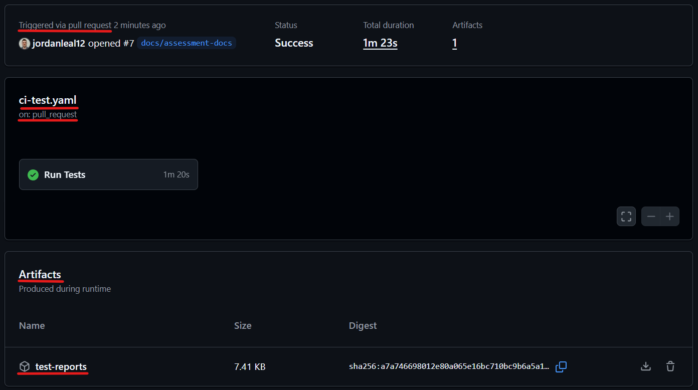
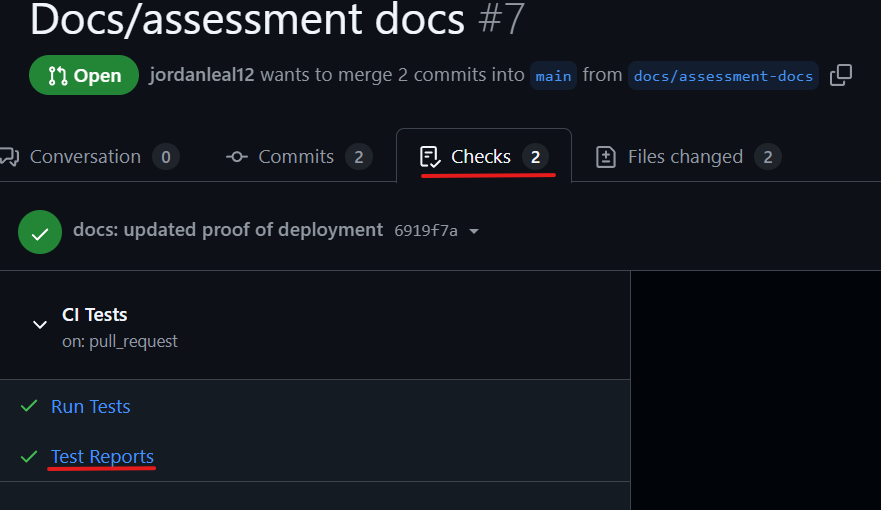
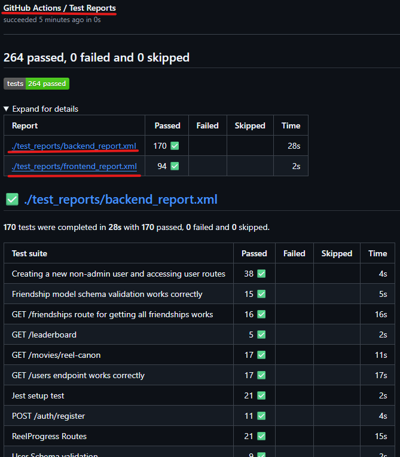
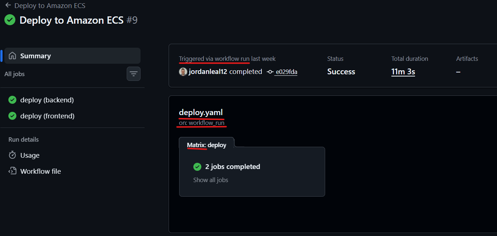
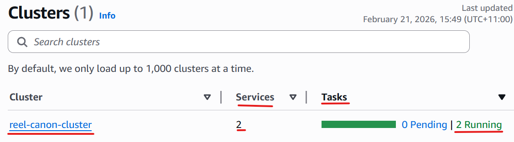
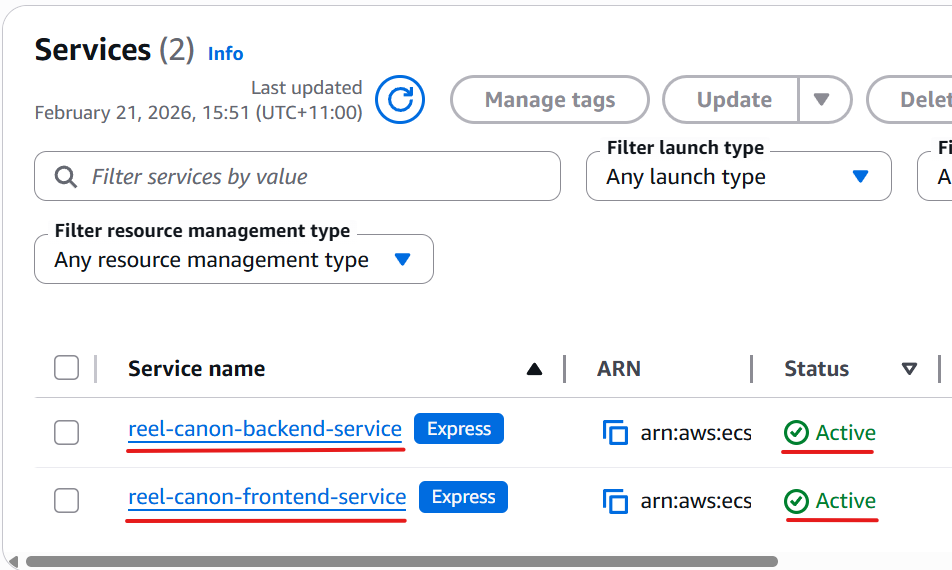
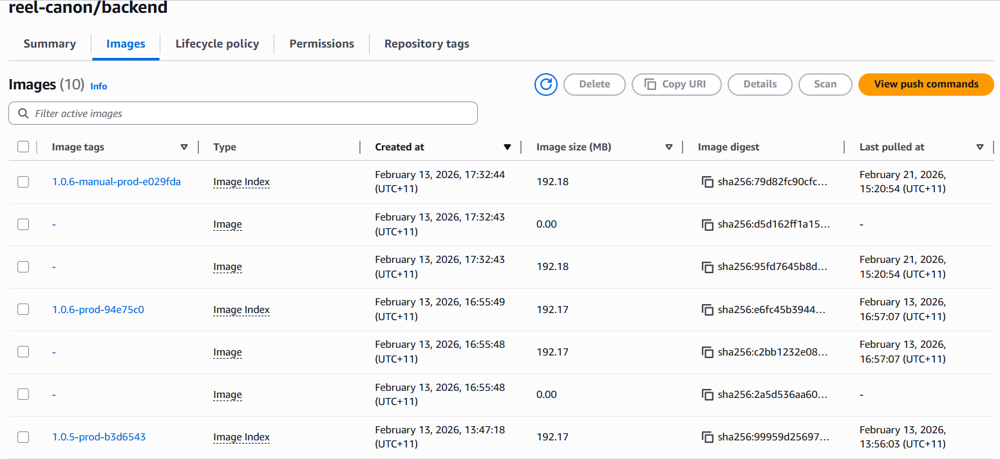

# Proof Of Deployment and Automation

The application is [deployed at this URL.](https://re-2b69362bbe8c493ea8c4cba2cfe431ff.ecs.ap-southeast-2.on.aws/) The tasks are currently stopped to reduce running costs, for assessment marking please contact me so I can start the tasks.

## Github Automation

### CI Tests Workflow

_`ci-tests.yaml` workflow triggered by pull request, successfully passes and stores test reports as persistent artifact_

_Test results are attached as a check run to the pull request_

_Formatted test report output_

### Build and Push Workflow

_`build-and-push.yaml` workflow triggered by git version update pushed to main, successfully passes and stores image tag as persistent artifact, using matrix to run concurrently_

### Deploy Workflow

_`deploy.yaml` workflow triggered from `build-and-push.yaml` workflow's successful completion, deploying to ECS using matrix to run concurrently._

### GitHub Secrets

_Repository secrets stored in GitHub Secrets_

## AWS Configuration

### Running ECS Cluster

_reel-canon-cluster running on AWS ECS_

### Running Services

_Backend and frontend services running in the cluster_

### Images Stored and Pulled From ECR

_Container images stored and pulled from ECR_

## Website Function

### Frontend URL Shows Running Application

_Frontend service shows running application_

### Persistent Data Loaded From Database

_Application shows successful retrieval of database information, proving functional connection to backend service_

