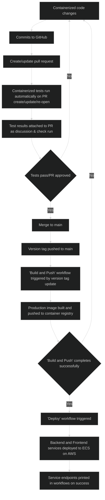
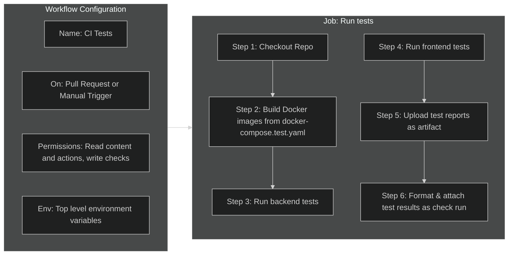
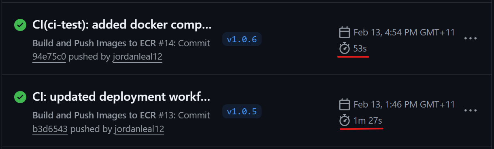
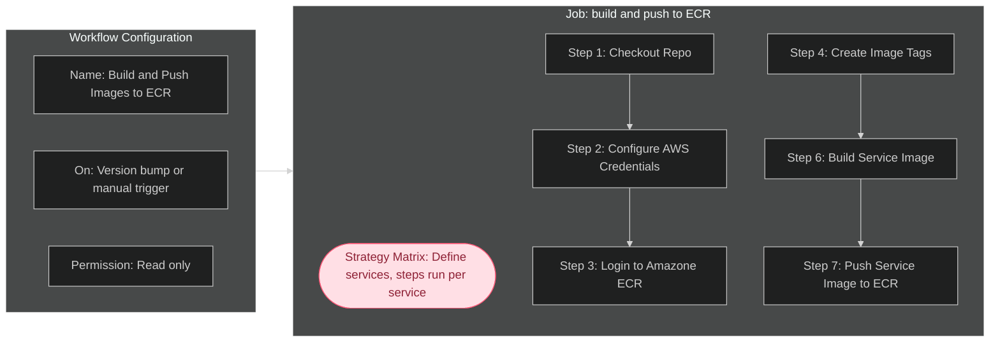

# Explaining the Purpose & Function of Application Automation Workflows

CI/CD automation is the process of configuring code to automatically execute tasks in a CI/CD pipeline when pre-defined conditions are met. Within this application, I use GitHub Actions to implement automation in the repository. GitHub Actions makes use of the yaml workflow files located in `.github/workflows/` to execute instructions in 'runners' (a virtual machine instance). These workflows utilize custom jobs and steps, as well as predefined actions from the GitHub Marketplace.

The goal of this automation is to create a well designed CI/CD pipeline, automating testing, building and pushing container images to a repository, and deployment of the application. This pipeline is represented by the following flowchart:

## Explaining `ci-test.yaml` Workflow

### Purpose of `ci-test.yaml` Workflow

When a pull request is opened, updated or re-opened to merge changes to the main branch, a test environment will be automatically created, and test suites will be run. The purpose of this is to check the new changes pass all existing tests, and are compatible with the existing code. These tests use a containerized version of the application, ensuring that the testing environment is as consistent as possible. The tests run here check the core functionality of the application, utilizing unit tests, end-to-end tests and other test types. This workflow can also be triggered manually, allowing developers to check test output on their branches without creating pull requests each time.

Relying on manual trigger of test suites introduces the risk of developers forgetting to run tests, catching bugs late, and merging unsatisfactory code. This can delay work, and potentially lead to faulty code being deployed. The implementation of this testing workflow is combined with branch protection rules to ensure code can only be merged to main through creation of pull requests. As such, the results of these tests will always be known before merging.

The `docker-compose.test.yaml` file utilized to create the containerized test application is configured to store the XML test reports using bind mounts. This keeps the test reports available to the runner after the containers exit, which then uses the `actions/upload artifact` action to upload the reports as artifacts. The purpose of this is to persist the test reports after job completion, with the ability to download and view these reports from the artifacts section of the job summary.

Separate to being uploaded as artifacts, these reports are also utilized by the `dorny/test-reporter` action. This action parses the report data, and attaches a configurable test summary output as a check run to a pull request. If the workflow was triggered manually, this report is available under all jobs in the workflow summary. The purpose of this is to create a persistent and visually optimized output of the test results, with customizable configuration.

### Functionality of `ci-test.yaml` Workflow

**The following flowchart shows the configuration and flow of the workflow:**

**This is a breakdown of the syntax and values utilized in this workflow:**

- **Name:** 'CI Tests'. Semantic naming of workflow for easier referencing
- **On:** Conditions that trigger the workflow. This workflow will trigger on workflow dispatch (manual trigger) and pull request to the main branch, with the default values of a pull request trigger being 'opened', 'synchronize' and 'reopened'
- **Permissions:** The permissions required for the workflow to function. This workflow uses read permissions for contents and actions, and write permissions for checks (needed by test-reporter action)
- **Env:** Top level environment variable declarations available to all jobs. OMDB_API_KEY, JWT_SECRET_KEY & DATABASE_URI values are mapped from the values stored as repository github secrets, accessed using the `${{}}` syntax, e.g. `JWT_SECRET_KEY: ${{ secrets.JWT_SECRET_KEY }}`. The COMPOSE_CMD value is not sensitive and is hardcoded to keep code DRY as it is used many times.
- **Concurrency:** This determines what happens when multiple concurrent instances of the same workflow are running. In this case, workflows are grouped by ref, cancelling in progress test workflows of the same group. This will prevent multiple unnecessary test workflows running when rapid sequential commits are made to an open PR.
- **Jobs:** A job is a set of sequential steps that take place on the same runner. In this instance, we only require one job 'Run Tests'. The job configuration is listed below:
  - **_ID:_** 'run_tests'. Used to reference this job.
  - **_Name:_** 'Run Tests'. Human readable job name displayed in UI.
  - **_Runs_on:_** Defines the job runner (VM instance), being ubuntu-latest. Using the latest tag ensures up to date security patches at the OS level of the runner.
  - **Steps:**
    - **_Checkout Repo:_** This will use the marketplace checkout action (actions/checkout@v6) to checkout the code from the repository, making it available to the workflow
    - **_Build Docker Images:_** This step will run the command `docker compose -f docker-compose.test.yaml` (defined earlier as env.COMPOSE_CMD) + `build`. The `-f` flag refers to the compose file to be use, and the `build` command builds the images without running the containers. Separating build and run commands steps improves debugging.
    - **_Run Backend Tests:_** Runs the command `env.COMPOSE_CMD` + `run --rm backend-test`. This runs the containers from the images built in the prior step, and the `--rm` flag ensures the container is removed upon test completion
    - **_Run Frontend Tests:_** Identical to the backend test step, with the addition of `if: always()` ensuring frontend tests run even if backend tests fail
    - **_Upload Test Report Artifacts:_** Uses the `actions/upload-artifact@v6` action to attach the test reports outputted from test completion as artifacts in the `./test_reports` folder. This ensures they persist upon workflow completion
    - **_Check Run Test Reports:_** Uses the `dorny/test-reporter@v2.5.0` action to parse the test reports written to the `./test_reports` folder on the runner using a bind mount, and add the results as a formatted check run to the pull request, or job under workflow summary if triggered manually.

---

## Explaining `build-and-push.yaml` Workflow

### Purpose of `build-and-push.yaml` Workflow

The purpose of this workflow is to build a docker image for both the frontend and backend service, generate a semantic tag, upload the tag as an artifact to use in the `deploy.yaml` workflow, and then to tag and push the respective images to the AWS ECR repository.

AWS's ECS (Elastic Container Registry) requires container images in order to deploy services as tasks. As code in the repository is updated the semantic Git version is updated to reflect complete meaningful changes. The deployed application should always reflect the latest version of this application, and as such, this workflow is triggered when a Git version bump is pushed to the main branch.

This is to ensure the process of deploying the application is automated, removing the need for developers to handle the deployment process every time the application version is updated. Since the deployment workflow is triggered upon successful completion of this workflow, this can be considered the first step in the automated deployment process.

This workflow can also be triggered manually, and this is reflected in the semantic versioning applied to the image tag. A matrix is used in this workflow to define the steps once for both backend and frontend service, passing in only the variables that differ. This keeps code DRY and allows the steps for each service to run in parallel, significantly reducing the workflow duration. This is shown in the image below, with the top run showing the time after implementing the matrix:

### Functionality of `build-and-push.yaml` Workflow

**The following flowchart shows the configuration and flow of the workflow:**

**This is a breakdown of the syntax and values utilized in this workflow:**

- **Name:** 'Build and Push Images to ECR'. Semantic naming of workflow for easier referencing
- **On:** Conditions that trigger the workflow. This workflow triggers on `push: tags: ["v*"]` and `workflow_dispatch`. The first triggers when a new repository tag is pushed that starts with 'v', e.g. 'v1.1.2'. The second allows manual triggering of the workflow.
- **Permission:** The permissions required for the workflow to function. This workflow uses read permissions only.
- **Jobs:** A job is a set of sequential steps that take place on the same runner. In this instance, we only require one job 'Build and push to ECR', with job configuration declared below:
  - **_Id:_** build_and_push_to_ecr
  - **_Name:_** Build and Push Images to ECR
  - **_Run-On:_** ubuntu-latest
  - **_Strategy:_** This job uses a strategy matrix to run multiple job runs from a single job definition, using combinations of variables declared in the matrix.
    - **_Matrix:_** Where the service variable will be declared.
      - **_Service:_** '[backend, frontend]'. Matrix variable are declared as an array with the job running once per combination of variable configurations. Since we have one variable with 2 configurations, the job will run twice in parallel.
      - **_include:_** The unique configuration for each variable configuration. This has a unique dockerfile_path for the frontend and backend service.
  - **Steps:** Individual steps will follow below, with these steps being executed once per service.
    **_1. Checkout Repo:_** This will use the marketplace checkout action (actions/checkout@v6) to checkout the code from the repository, making it available to the workflow
    **_2. Configure AWS Credentials:_** This step configures credentials in the workflow using a previously created IAM user with the appropriate permissions, and the `aws-actions/configure-aws-credentials@v5` action. `AWS_ACCESS_KEY_ID`, `AWS_SECRET_ACCESS_KEY` and `AWS_REGION` secret variables are stored in GitHub Secrets and made available to the step using context interpolation.
    **_3. Login To Amazon ECR:_** T`aws-actions/amazon-ecr-login@v2` action is used to login to the Elastic Container Registry.
    **_4. Create Image Tags:_** When the workflow is triggered automatically, the repository tag will be fetched from the ref, stripping the 'v' and appending '-prod-' and the first 7 characters of the commit SHA. For example, pushing the tag 'v.1.3.2' to the repository with a commit SHA of 'abc1234567...' will result in a tag of `1.3.2-prod-abc1234`. When manually triggering the workflow, the latest tag is fetched using `git tag`, and the word 'manual' is appended to prevent version conflicts, then the commit SHA - i.e. `1.3.2-manual-prod-abc1234`.
    **_5. Upload Tag Artifact:_** As our current workflow and our deploy workflow are separated (to improve debugging), `tag.txt` is uploaded an 'artifact', which is a temporary file/folder which can be shared between workflows in the same repository. This will use the `upload-artifact@v6` action. This action only triggers for backend service, preventing duplicate artifact uploading.
    **_6. Build Service Image:_** Here we build and attach the tag to the service image. The full image URL, name and tag uses interpolation to assign the image tag dynamically, as follows: `${{ steps.login-ecr.outputs.registry }}${{ vars.SERVICE_NAME }}/${{ matrix.service }}:${{ steps.create_tags.outputs.tag }}`
    **_7. Push Service Image to ECR:_** Using the same full image name and tag shown in the above step, the image will be pushed using `docker push <url:name:tag>`

---

## Explaining `deploy.yaml` Workflow

### Purpose of `deploy.yaml` Workflow

### Functionality of `deploy.yaml` Workflow
