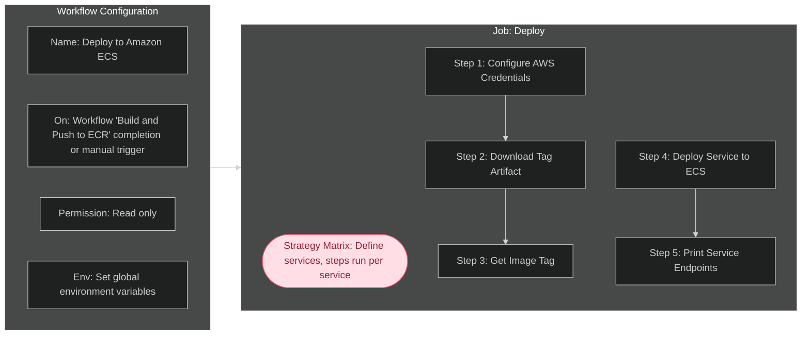

# Explaining the Purpose & Function of Application Automation Workflows

CI/CD automation is the process of configuring code to automatically execute tasks in a CI/CD pipeline when pre-defined conditions are met. Within this application, I use GitHub Actions to implement automation in the repository. GitHub Actions makes use of the yaml workflow files located in `.github/workflows/` to execute instructions in 'runners' (a virtual machine instance). These workflows utilize custom jobs and steps, as well as predefined actions from the GitHub Marketplace.

The goal of this automation is to create a well designed CI/CD pipeline, automating testing, building and pushing container images to a repository, and deployment of the application. This pipeline is represented by the following flowchart:

## Explaining `ci-test.yaml` Workflow

### Purpose of `ci-test.yaml` Workflow

When a pull request is opened, updated or re-opened to merge changes to the main branch, a test environment will be automatically created, and test suites will be run. The purpose of this is to check the new changes pass all existing tests, and are compatible with the existing code. These tests use a containerized version of the application, ensuring that the testing environment is as consistent as possible. The tests run here check the core functionality of the application, utilizing unit tests, end-to-end tests and other test types. This workflow can also be triggered manually, allowing developers to check test output on their branches without creating pull requests each time.

Relying on manual trigger of test suites introduces the risk of developers forgetting to run tests, catching bugs late, and merging unsatisfactory code. This can delay work, and potentially lead to faulty code being deployed. The implementation of this testing workflow is combined with branch protection rules to ensure code can only be merged to main through creation of pull requests. As such, the results of these tests will always be known before merging.

The `docker-compose.test.yaml` file utilized to create the containerized test application is configured to store the XML test reports using bind mounts. This keeps the test reports available to the runner after the containers exit, which then uses the `actions/upload artifact` action to upload the reports as artifacts. The purpose of this is to persist the test reports after job completion, with the ability to download and view these reports from the artifacts section of the job summary.

Separate to being uploaded as artifacts, these reports are also utilized by the `dorny/test-reporter` action. This action parses the report data, and attaches a configurable test summary output as a check run to a pull request. If the workflow was triggered manually, this report is available under all jobs in the workflow summary. The purpose of this is to create a persistent and visually optimized output of the test results, with customizable configuration.

### Functionality of `ci-test.yaml` Workflow

**The following flowchart shows the configuration and flow of the workflow:**

**This is a breakdown of the syntax and values utilized in this workflow:**

- **Name:** 'CI Tests'. Semantic naming of workflow for easier referencing
- **On:** Conditions that trigger the workflow. This workflow will trigger on workflow dispatch (manual trigger) and pull request to the main branch, with the default values of a pull request trigger being 'opened', 'synchronize' and 'reopened'
- **Permissions:** The permissions required for the workflow to function. This workflow uses read permissions for contents and actions, and write permissions for checks (needed by test-reporter action)
- **Env:** Top level environment variable declarations available to all jobs. OMDB_API_KEY, JWT_SECRET_KEY & DATABASE_URI values are mapped from the values stored as repository github secrets, accessed using the `${{}}` syntax, e.g. `JWT_SECRET_KEY: ${{ secrets.JWT_SECRET_KEY }}`. The COMPOSE_CMD value is not sensitive and is hardcoded to keep code DRY as it is used many times.
- **Concurrency:** This determines what happens when multiple concurrent instances of the same workflow are running. In this case, workflows are grouped by ref, cancelling in progress test workflows of the same group. This will prevent multiple unnecessary test workflows running when rapid sequential commits are made to an open PR.
- **Jobs:** A job is a set of sequential steps that take place on the same runner. In this instance, we only require one job 'Run Tests'. The job configuration is listed below:
  - **_ID:_** 'run_tests'. Used to reference this job.
  - **_Name:_** 'Run Tests'. Human readable job name displayed in UI.
  - **_Runs-On:_** Defines the job runner (VM instance), being ubuntu-latest. Using the latest tag ensures up to date security patches at the OS level of the runner.
  - **Steps:**
    - **_1. Checkout Repo:_** This will use the marketplace checkout action (actions/checkout@v6) to checkout the code from the repository, making it available to the workflow
    - **_2. Build Docker Images:_** This step will run the command `docker compose -f docker-compose.test.yaml` (defined earlier as env.COMPOSE_CMD) + `build`. The `-f` flag refers to the compose file to be use, and the `build` command builds the images without running the containers. Separating build and run commands steps improves debugging.
    - **_3. Run Backend Tests:_** Runs the command `env.COMPOSE_CMD` + `run --rm backend-test`. This runs the containers from the images built in the prior step, and the `--rm` flag ensures the container is removed upon test completion
    - **_4. Run Frontend Tests:_** Identical to the backend test step, with the addition of `if: always()` ensuring frontend tests run even if backend tests fail
    - **_5. Upload Test Report Artifacts:_** Uses the `actions/upload-artifact@v6` action to attach the test reports outputted from test completion as artifacts in the `./test_reports` folder. This ensures they persist upon workflow completion
    - **_6. Check Run Test Reports:_** Uses the `dorny/test-reporter@v2.5.0` action to parse the test reports written to the `./test_reports` folder on the runner using a bind mount, and add the results as a formatted check run to the pull request, or job under workflow summary if triggered manually.

---

## Explaining `build-and-push.yaml` Workflow

### Purpose of `build-and-push.yaml` Workflow

The purpose of this workflow is to build a docker image for both the frontend and backend service, generate a semantic tag, upload the tag as an artifact to use in the `deploy.yaml` workflow, and then to tag and push the respective images to the AWS ECR repository.

AWS's ECS (Elastic Container Registry) requires container images in order to deploy services as tasks. As code in the repository is updated the semantic Git version is updated to reflect complete meaningful changes. The deployed application should always reflect the latest version of this application, and as such, this workflow is triggered when a Git version bump is pushed to the main branch.

This is to ensure the process of deploying the application is automated, removing the need for developers to handle the deployment process every time the application version is updated. Since the deployment workflow is triggered upon successful completion of this workflow, this can be considered the first step in the automated deployment process.

This workflow can also be triggered manually, and this is reflected in the semantic versioning applied to the image tag. A matrix is used in this workflow to define the steps once for both backend and frontend service, passing in only the variables that differ. This keeps code DRY and allows the steps for each service to run in parallel, significantly reducing the workflow duration. This is shown in the image below, with the top run showing the time after implementing the matrix:

### Functionality of `build-and-push.yaml` Workflow

**The following flowchart shows the configuration and flow of the workflow:**

**This is a breakdown of the syntax and values utilized in this workflow:**

- **Name:** 'Build and Push Images to ECR'. Semantic naming of workflow for easier referencing
- **On:** Conditions that trigger the workflow. This workflow triggers on `push: tags: ["v*"]` and `workflow_dispatch`. The first triggers when a new repository tag is pushed that starts with 'v', e.g. 'v1.1.2'. The second allows manual triggering of the workflow.
- **Permission:** The permissions required for the workflow to function. This workflow uses read permissions only.
- **Jobs:** A job is a set of sequential steps that take place on the same runner. In this instance, we only require one job 'Build and push to ECR', with job configuration declared below:
  - **_Id:_** 'build_and_push_to_ecr'. Used to reference this job.
  - **_Name:_** Build and Push Images to ECR
  - **_Runs-On:_** Defines the job runner (VM instance), being ubuntu-latest. Using the latest tag ensures up to date security patches at the OS level of the runner.
  - **_Strategy:_** This job uses a strategy matrix to run multiple job runs from a single job definition, using combinations of variables declared in the matrix.
    - **_Matrix:_** Where the service variable will be declared.
      - **_Service:_** '[backend, frontend]'. Matrix variables are declared as an array with the job running once per combination of variable configurations. Since we have one variable with 2 configurations, the job will run twice in parallel.
      - **_include:_** The unique configuration for each variable configuration. This has a unique dockerfile_path for the frontend and backend service.
  - **Steps:** Individual steps will follow below, with these steps being executed once per service.
    - **_1. Checkout Repo:_** This will use the marketplace checkout action (actions/checkout@v6) to checkout the code from the repository, making it available to the workflow
    - **_2. Configure AWS Credentials:_** This step configures credentials in the workflow using a previously created IAM user with the appropriate permissions, and the `aws-actions/configure-aws-credentials@v5` action. `AWS_ACCESS_KEY_ID`, `AWS_SECRET_ACCESS_KEY` and `AWS_REGION` secret variables are stored in GitHub Secrets and made available to the step using context interpolation.
    - **_3. Login To Amazon ECR:_** The `aws-actions/amazon-ecr-login@v2` action is used to login to the Elastic Container Registry.
    - **_4. Create Image Tags:_** When the workflow is triggered automatically, the repository tag will be fetched from the ref, stripping the 'v' and appending '-prod-' and the first 7 characters of the commit SHA. For example, pushing the tag 'v.1.3.2' to the repository with a commit SHA of 'abc1234567...' will result in a tag of `1.3.2-prod-abc1234`. When manually triggering the workflow, the latest tag is fetched using `git tag`, and the word 'manual' is appended to prevent version conflicts, then the commit SHA - i.e. `1.3.2-manual-prod-abc1234`.
    - **_5. Upload Tag Artifact:_** As our current workflow and our deploy workflow are separated (to improve debugging), `tag.txt` is uploaded an 'artifact', which is a temporary file/folder which can be shared between workflows in the same repository. This will use the `upload-artifact@v6` action. This action only triggers for backend service, preventing duplicate artifact uploading.
    - **_6. Build Service Image:_** Here we build and attach the tag to the service image. The full image URL, name and tag uses interpolation to assign the image tag dynamically, as follows: `${{ steps.login-ecr.outputs.registry }}${{ vars.SERVICE_NAME }}/${{ matrix.service }}:${{ steps.create_tags.outputs.tag }}`
    - **_7. Push Service Image to ECR:_** Using the same full image name and tag shown in the above step, the image will be pushed using `docker push <url:name:tag>`

---

## Explaining `deploy.yaml` Workflow

### Purpose of `deploy.yaml` Workflow

The purpose of this workflow is to provision cloud compute resources through AWS to deploy our application, using their Elastic Container Service (ECS). ECS is a highly scalable and fast container management service that makes it easy to run, stop, and manage containers on a cluster.

This application will be running an application cluster across 2 availability zones, containing a frontend and backend service, with each service running a minimum of 1 and maximum of 4 'serverless' AWS Fargate managed tasks containing a single Docker container each.

In order to facilitate that, this workflow configures AWS credentials, downloads the tag artifact from our previous workflow, and then deploys the application using secrets, repository variables and the previously created application images in ECR. The purpose of using a workflow here is to ensure the deployment configuration is consistent, reusable and automated. Manual deployment of this application is possible through the AWS console or manual CLI commands, but doing so introduces increased risk of human error and unintended differences between deployment configurations.

Successful completion of the 'Build and Push to ECR' workflow triggers this workflow to commence, ensuring the full deployment process is automated from the initial Git version bump triggering said workflow. This workflow can also be manually triggered, and requires the image tag to be deployed as an input.

As with the build-and-push workflow, a strategy matrix is used in this workflow to define the steps once for both backend and frontend service, passing in only the variables that differ. Upgrading the workflow to use this led to a significant reduction in deployment time, demonstrated in the below image where the top run was performed after adding the matrix:

Earlier versions of this workflow had an issue with security The sensitive variables being passed to the application where displayed as plain text within the 'configuration' tab of each service within the AWS console. To rectify this, the values are now stored as secure string parameters within AWS Systems Manager (SSM) Parameter Store. The values displayed in the 'configuration' tab now show only an ARN referencing the secure variables, not the plain text value:

A limitation of the deploy workflow is the requirement to deploy the application twice the first time it is ever deployed. As the frontend service requires the URL of the deployed backend service as a build argument, this value is unable to be changed after the frontend is compiled.

As such, the `BACKEND_URL` secret value is required to be updated after the initial deployment to the backend service endpoint, which remains constant for all subsequent deployments. This limitation could be overcome by creating separate workflows for each service, or by assigning a paid DNS through AWS. For this application, I decided the downsides of either approach outweighed the singular redeployment required only when deploying the application for the first time.

### Functionality of `deploy.yaml` Workflow

**The following flowchart shows the configuration and flow of the workflow:**

**This is a breakdown of the syntax and values utilized in this workflow:**

- **Name:** 'Deploy to Amazon ECS'. Semantic naming of workflow for easier referencing
- **On:** Conditions that trigger the workflow. This workflow triggers on `workflow_run:`, which names a workflow to trigger this workflow, being the 'Build and Push Images to ECR' workflow. `types:[completed]` sets it to only trigger on completion. `workflow_dispatch` allows manual trigger with an `inputs` field setting a `tag` as required and adding a description. This is used to provide the desired tag when manually triggering the workflow.
- **Permission:** The permissions required for the workflow to function. This workflow uses read permissions only.
- **Env:** Top level environment variable declarations available to all jobs. ECR_REGISTRY is declared here using AWS_ACCOUNT_ID and AWS_REGION as dynamic repository secrets. This keeps the workflow DRY and allows easier workflow re-use across deployments.
- **Jobs:** A job is a set of sequential steps that take place on the same runner. In this instance, we only require one job 'deploy', with job configuration declared below:
  - **_Id:_** 'deploy'. Used to reference this job.
  - **_Runs-On:_** Defines the job runner (VM instance), being ubuntu-latest. Using the latest tag ensures up to date security patches at the OS level of the runner.
  - **_Strategy:_** This job uses a strategy matrix to run multiple job runs from a single job definition, using combinations of variables declared in the matrix.
    - **_Matrix:_** Where the service variable will be declared.
      - **_Service:_** '[backend, frontend]'. Matrix variables are declared as an array with the job running once per combination of variable configurations. Since we have one variable with 2 configurations, the job will run twice in parallel.
      - **_include:_** The unique configuration for each variable configuration. Each service here has unique values for container_port, environment-variables, secrets, memory, security-groups and health-check-path, using repository variables where possible to keep the workflow highly reusable across different applications.
  - **If:** Conditional statement to be met for the job to proceed. If the workflow was triggered manually, it proceeds. If triggered by workflow dispatch, the workflow run is required to have completed successfully. This prevents the workflow attempting to deploy when the previous workflow failed.
  - **Steps:** Individual steps will follow below, with these steps being executed once per service.
    - **_1. Configure AWS Credentials:_** This step configures credentials in the workflow using a previously created IAM user with the appropriate permissions, and the `aws-actions/configure-aws-credentials@v5` action. `AWS_ACCESS_KEY_ID`, `AWS_SECRET_ACCESS_KEY` and `AWS_REGION` secret variables are stored in GitHub Secrets and made available to the step using context interpolation.
    - **_2. Download Tag Artifact:_** The `tag.txt` file created in the previous workflow is downloaded and made available to this workflow using the `actions/download-artifact@v7` action.
    - **_3. Get Image Tag:_** Here the value of `$TAG` is assigned from the `tag.txt` artifact, or from the manual input if the workflow was manually triggered.
    - **_4. Deploy Services to ECS:_** Here we use the `aws-actions/amazon-ecs-deploy-express-service` action to configure and deploy both services. Listed are the configuration variables and their purpose:
      - **Service-name:** Defines service name.
      - **Image:** Image URI referencing service image pushed to ECR in previous step.
      - **Execution-role-arn:** ARN of IAM role used to grant action permission to pull container images.
      - **Infrastructure-role-arn:** ARN of IAM role giving action permission to create and manage AWS resources.
      - **Cluster:** The name of the ECS cluster containing the application tasks.
      - **Container-port:** The container port each service listens on.
      - **Environment-variables:** Required non-sensitive variables to be passed to the service
      - **Secrets:** Required sensitive variables to be passed to the service. These are passed as an 'arn' referencing secure string parameters stored within AWS Systems Manager (SSM) Parameter Store. This prevents the values being displayed within the service as plain text in the AWS console.
      - **Tags:** An array of tags applied to the service in AWS.
      - **CPU:** The amount of CPU units assigned to an individual service task.
      - **Memory:** The RAM assigned to an individual service task.
      - **Subnets:** An array of the subnets for the services to run in. The 2 subnets provided are in separate availability zones, allowing application tasks to be spread across both.
      - **Security-groups:** The stateful security groups assigned to each service to act as a resource level firewall.
      - **Health-check-path:** The endpoint that ECS calls to run automated health checks.
      - **Min-task-count:** Minimum amount of tasks that the service will run at idle. Due to ECS ability to quickly start new tasks, and to automatically monitor task health and replace unhealthy tasks, this is left as 1 to reduce running costs.
      - **Max-task-count:** The maximum amount of running tasks each service can auto-scale up to under load.
      - **Auto-scaling-metric:** The value that is monitored to determine when to auto-scale new service tasks. Average CPU load is used here.
      - **Auto-scaling-target-value:** If the auto-scaling-metric reaches this value, auto-scaling is triggered. This is set to 70, representing 70% average CPU load.
    - **_5. Print Service Endpoints:_** A success message and the URL of the deployed service is printed.
